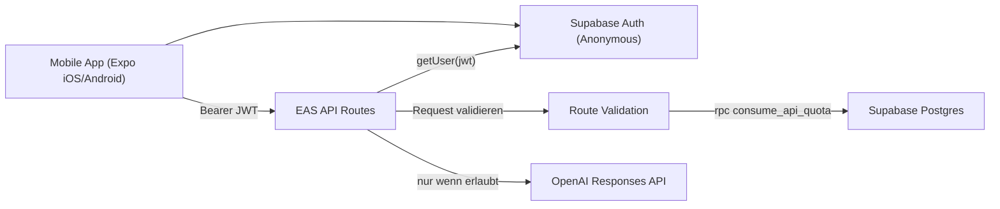

# Supabase API Security Implementation Plan (Code Companion)

## Ziel
Die bestehenden Expo API-Routes sollen so abgesichert werden, dass:

1. Jede Anfrage eine gueltige (anonyme) Nutzeridentitaet hat.
2. OpenAI-Aufrufe pro Nutzer und Tag begrenzt werden.
3. Missbrauchskosten kontrolliert werden.
4. Die Umsetzung mit minimaler Architektur und klarer Human-in-the-Loop-Freigabe erfolgt.

## Ausgangslage im aktuellen Code
- Ungeschuetzte API-Routes:
  - `app/api/quiz/generate+api.ts`
  - `app/api/quiz/generate-mixed+api.ts`
  - `app/api/topic/explain+api.ts`
- OpenAI-Aufruf:
  - `server/quiz.ts`
- Client API-Layer:
  - `client/lib/query-client.ts`

Aktuell gibt es keine verpflichtende Authentifizierung und keine serverseitige Quota-Pruefung vor dem OpenAI-Call.

## Scope (Minimalistische Zielarchitektur)
- Authentifizierung: Supabase Anonymous Auth.
- Autorisierung/Schutz: zentrale Auth- und Quota-Helfer in den Expo API-Routes.
- Speicherung: minimale Quota-Tabellen in Supabase Postgres.
- Keine zusaetzliche eigene Infrastruktur (kein Redis, kein zweites Backend).

## Nicht im Scope (zunaechst)
- App Attestation (Play Integrity/App Attest).
- Komplexe Rollen/Rechtesysteme.
- Vollstaendige Nutzungsanalytik.
- Persistenter Prompt-Verlauf.

## Rollenmodell (Human in the Loop)

### Human (erforderlich)
- Supabase-Projekt anlegen/auswaehlen.
- Anonymous Auth im Dashboard aktivieren.
- API-Keys aus Supabase bereitstellen.
- Environment-Variablen in EAS konfigurieren.
- Migrationen im Dashboard freigeben/einspielen.
- Go/No-Go Entscheidungen pro Phase.

### Coding-Agent
- Codeanpassungen im Repo umsetzen.
- SQL-Skripte/Migrationsdateien vorbereiten.
- Guard implementieren und in alle Routes integrieren.
- Tests ergaenzen/anpassen.
- Dokumentation aktualisieren.

### Gemeinsame Checkpoints
Jede Phase endet mit einem Freigabepunkt. Ohne Human-Freigabe keine naechste Phase.

## Zielarchitektur


```mermaid
flowchart LR
  A["Mobile App (Expo iOS/Android)"] -->|"Bearer JWT"| B["EAS API Routes"]
  A --> C["Supabase Auth (Anonymous)"]
  B -->|"getUser(jwt)"| C
  B -->|"Request validieren"| V["Route Validation"]
  V -->|"rpc consume_api_quota"| D["Supabase Postgres"]
  B -->|"nur wenn erlaubt"| E["OpenAI Responses API"]
```

## Datenmodell (exakte SQL-Definition)

Die folgenden SQL-Objekte sind die Referenz fuer die Umsetzung.

```sql
-- 1) Endpoint-Typ
create type public.api_endpoint as enum (
  'quiz_generate',
  'quiz_generate_mixed',
  'topic_explain'
);

-- 2) Private Schema fuer Quota-Daten
create schema if not exists private;
revoke all on schema private from public;

-- 3) Tageszaehler je User + Endpoint
create table private.api_usage_daily (
  user_id uuid not null references auth.users(id) on delete cascade,
  usage_date date not null default (now() at time zone 'utc')::date,
  endpoint public.api_endpoint not null,
  request_count integer not null default 0 check (request_count >= 0),
  last_request_at timestamptz not null default now(),
  primary key (user_id, usage_date, endpoint)
);

create index api_usage_daily_usage_date_idx
  on private.api_usage_daily (usage_date, endpoint);

-- 4) Optional: individuelle Limits + Blockierung
create table private.api_user_limits (
  user_id uuid primary key references auth.users(id) on delete cascade,
  quiz_generate_limit integer check (quiz_generate_limit is null or quiz_generate_limit > 0),
  quiz_generate_mixed_limit integer check (quiz_generate_mixed_limit is null or quiz_generate_mixed_limit > 0),
  topic_explain_limit integer check (topic_explain_limit is null or topic_explain_limit > 0),
  blocked_until timestamptz,
  note text,
  updated_at timestamptz not null default now()
);

-- 5) Atomarer Quota-Check + Inkrement
create or replace function public.consume_api_quota(
  p_user_id uuid,
  p_endpoint public.api_endpoint,
  p_default_limit integer
)
returns table (
  allowed boolean,
  used integer,
  limit_value integer,
  remaining integer,
  reset_at timestamptz,
  blocked boolean
)
language plpgsql
security invoker
set search_path = ''
as $$
declare
  v_limit integer;
  v_used integer;
  v_today date := (now() at time zone 'utc')::date;
  v_reset_at timestamptz := (
    date_trunc('day', now() at time zone 'utc') + interval '1 day'
  ) at time zone 'utc';
  v_blocked_until timestamptz;
begin
  if p_default_limit < 1 then
    raise exception 'p_default_limit must be >= 1';
  end if;

  select
    l.blocked_until,
    case p_endpoint
      when 'quiz_generate'::public.api_endpoint then l.quiz_generate_limit
      when 'quiz_generate_mixed'::public.api_endpoint then l.quiz_generate_mixed_limit
      when 'topic_explain'::public.api_endpoint then l.topic_explain_limit
    end
  into v_blocked_until, v_limit
  from private.api_user_limits l
  where l.user_id = p_user_id;

  v_limit := coalesce(v_limit, p_default_limit);

  select d.request_count
  into v_used
  from private.api_usage_daily d
  where d.user_id = p_user_id
    and d.usage_date = v_today
    and d.endpoint = p_endpoint;

  if v_blocked_until is not null and v_blocked_until > now() then
    return query
      select false, coalesce(v_used, 0), v_limit, 0, v_reset_at, true;
    return;
  end if;

  insert into private.api_usage_daily as d (
    user_id,
    usage_date,
    endpoint,
    request_count,
    last_request_at
  )
  values (p_user_id, v_today, p_endpoint, 1, now())
  on conflict (user_id, usage_date, endpoint)
  do update
    set request_count = d.request_count + 1,
        last_request_at = now()
    where d.request_count < v_limit
  returning request_count into v_used;

  if found then
    return query
      select true, v_used, v_limit, greatest(v_limit - v_used, 0), v_reset_at, false;
    return;
  end if;

  select d.request_count
  into v_used
  from private.api_usage_daily d
  where d.user_id = p_user_id
    and d.usage_date = v_today
    and d.endpoint = p_endpoint;

  return query
    select false, coalesce(v_used, 0), v_limit, 0, v_reset_at, false;
end;
$$;

grant usage on schema private to service_role;
grant select, insert, update on private.api_usage_daily to service_role;
grant select on private.api_user_limits to service_role;
revoke execute on function public.consume_api_quota(uuid, public.api_endpoint, integer) from public, anon, authenticated;
grant execute on function public.consume_api_quota(uuid, public.api_endpoint, integer) to service_role;
```

Entscheidungen fuer die MVP-Referenzfunktion:
- `400`-Requests verbrauchen keine Quota, weil die Quota-Pruefung erst nach erfolgreicher Payload-Validierung erfolgt.
- `429`-Requests erhoehen den Tageszaehler nicht weiter; `used` bleibt auf dem letzten erlaubten Stand.
- Die Funktion ist bewusst `security invoker`, nicht `security definer`.
- Grund: Die Expo API-Route ruft sie nur serverseitig mit Supabase Secret Key bzw. `service_role` auf. Dadurch bleibt die Semantik einfacher und es wird kein `security definer` in einem exponierten RPC-Schema benoetigt.

## Auth- und Quota-API-Contract (Referenz)

Dateien:
- `app/api/_lib/auth.ts`
- `app/api/_lib/quota.ts`

```ts
export type ApiEndpoint = "quiz_generate" | "quiz_generate_mixed" | "topic_explain";

export interface AuthContext {
  userId: string;
}

export interface QuotaContext {
  userId: string;
  endpoint: ApiEndpoint;
  used: number;
  limit: number;
  remaining: number;
  resetAt: string;
}

export async function requireApiIdentity(
  request: Request,
): Promise<AuthContext | Response>;

export async function requireApiQuota(
  userId: string,
  endpoint: ApiEndpoint,
): Promise<QuotaContext | Response>;
```

Erwartetes Verhalten:
- `401 Unauthorized`: fehlender/ungueltiger Bearer-Token.
- `403 Forbidden`: Nutzer temporaer gesperrt (`blocked_until`).
- `429 Too Many Requests`: Quota erreicht.
- `200`: `AuthContext` bzw. `QuotaContext` zur Weiterverarbeitung.
- `400`: ungueltige Payload wird vor Quota-Verbrauch abgewiesen.

Empfohlene Header bei `429`:
- `Retry-After`
- `X-RateLimit-Limit`
- `X-RateLimit-Remaining`
- `X-RateLimit-Reset`

## Environment-Variablen

### Client (Expo Bundle)
- `EXPO_PUBLIC_SUPABASE_URL`
- `EXPO_PUBLIC_SUPABASE_PUBLISHABLE_KEY`
- `EXPO_PUBLIC_API_URL` (bestehend)

### API-Routes (nur Server)
- `SUPABASE_URL`
- `SUPABASE_SECRET_KEY` (oder aequivalent eures Projekts)
- `OPENAI_API_KEY` (bestehend)
- `OPENAI_MODEL` (optional, bestehend)

Hinweis: In EAS Hosting nach Aenderungen an Server-Env-Variablen neu deployen.

## Implementierungs-Backlog (mit Human-Gates)

## Phase 0 - Kickoff und Sicherheitsgrenzen
Owner: Human + Coding-Agent

Schritte:
1. Human bestaetigt Ziel-Limits fuer MVP (z. B. pro User/Tag):
   - `quiz_generate = 40`
   - `quiz_generate_mixed = 20`
   - `topic_explain = 30`
2. Human bestaetigt das Quota-Modell fuer das MVP:
   - Start mit request-basierter Tagesquote pro Endpoint
   - denied Over-Limit-Requests (`429`) erhoehen `used` nicht weiter
   - bei zu grober Kostensteuerung spaeter Erweiterung auf gewichtete Quota-Einheiten
3. Human bestaetigt Datenschutz-Minimum:
   - nur pseudonyme `user_id`
   - keine Prompt-Historie
   - Aufbewahrung Quota-Daten max. 30 Tage

Abnahme:
- Schriftliche Freigabe der Limits, des Quota-Modells und der Datenminimierung.

## Phase 1 - Supabase Projekt und Auth aktivieren
Owner: Human

Schritte:
1. Supabase-Projekt erstellen oder bestehendes Projekt waehlen.
2. Dashboard: `Authentication -> Providers -> Anonymous` aktivieren.
3. Keys notieren:
   - URL
   - Publishable key
   - Secret key (serverseitig)
4. Human uebergibt diese Werte an den Coding-Agent (nicht in Git committen).

Abnahme:
- Human bestaetigt, dass anonyme Sign-ins im Dashboard aktiv sind.
- Keys liegen als lokale/EAS-Umgebungsvariablen vor.

## Phase 2 - Datenbank-Migration einspielen
Owner: Human (Ausfuehrung) + Coding-Agent (SQL liefern)

Schritte:
1. Coding-Agent erstellt Migration unter `supabase/migrations/...`.
2. Human spielt SQL im Supabase SQL Editor ein (oder ueber CI/CLI).
3. Human prueft:
   - Typ `public.api_endpoint` vorhanden
   - Tabellen in `private` vorhanden
   - Funktion `public.consume_api_quota` vorhanden

Abnahme:
- SQL erfolgreich ohne Fehler ausgefuehrt.

## Phase 3 - Client: anonyme Session und Token-Transport
Owner: Coding-Agent

Dateien:
- Neu: `client/lib/supabase.ts`
- Anpassung: `client/lib/query-client.ts`
- Optional: Root Init in `app/_layout.tsx` oder geeigneter Stelle

Schritte:
1. Fehlende Abhaengigkeiten einplanen:
   - `@supabase/supabase-js`
   - `react-native-url-polyfill`
   - optional `expo-secure-store` fuer native Token-Speicherung
2. Supabase Client fuer Expo initialisieren (native + web beachten).
3. Beim App-Start `signInAnonymously`, falls keine Session vorhanden.
4. Access Token holen.
5. `apiRequest(...)` erweitert `Authorization: Bearer <token>`.
6. Fehlerfall im Client klar behandeln (`401`, `429`).
7. Keine Auth auf Cookies stuetzen; Bearer-Token ist die relevante Identitaet.

Abnahme:
- Ohne Token keine API-Nutzung moeglich.
- Mit Token laufen bestehende Quiz-/Explain-Flows weiter.

## Phase 4 - Server: zentrale Auth-/Quota-Helfer + Supabase Server Client
Owner: Coding-Agent

Dateien:
- Neu: `app/api/_lib/supabase-server.ts`
- Neu: `app/api/_lib/auth.ts`
- Neu: `app/api/_lib/quota.ts`

Schritte:
1. Serverseitigen Supabase Client mit Secret Key bauen.
2. `Authorization` Header parsen.
3. `supabase.auth.getUser(jwt)` zur Token-Validierung nutzen.
4. `consume_api_quota` per RPC aufrufen.
5. Einheitliche Response fuer `401/403/429` implementieren.
6. Quota-Verbrauch nur nach erfolgreicher Payload-Validierung ausloesen.

Abnahme:
- Unit-Tests fuer Auth- und Quota-Helfer decken alle Pfade ab.

## Phase 5 - Auth/Quota in alle OpenAI-Routes integrieren
Owner: Coding-Agent

Dateien:
- `app/api/quiz/generate+api.ts`
- `app/api/quiz/generate-mixed+api.ts`
- `app/api/topic/explain+api.ts`

Schritte:
1. Zu Beginn jeder Route `requireApiIdentity(...)` aufrufen.
2. Bei `Response` sofort return.
3. Danach Request-Body parsen und Eingaben validieren.
4. Erst unmittelbar vor dem OpenAI-Aufruf `requireApiQuota(...)` aufrufen.
5. Bei `Response` sofort return.
6. Logausgaben auf minimale sichere Informationen reduzieren.

Abnahme:
- OpenAI wird ohne erfolgreiche Authentifizierung und Quota-Freigabe nie aufgerufen.
- Ungueltige Requests (`400`) verbrauchen keine Quota.
- Wiederholte `429`-Requests treiben `used` nicht ueber das Tageslimit.

## Phase 6 - Input-Hardening parallel umsetzen
Owner: Coding-Agent

Konkrete Regeln:
1. `count` begrenzen:
   - `quiz_generate`: min 1, max 20
   - `quiz_generate_mixed`: min 1, max 20
2. `language` whitelisten: `en | de`.
3. `topicIds` limitieren:
   - max Array-Laenge 10
   - nur bekannte IDs
4. Fehlernachrichten fuer Client generisch halten.

Abnahme:
- Negative Tests fuer Grenzwerte vorhanden.

## Phase 7 - EAS Environment und Deployment
Owner: Human (EAS Konfiguration) + Coding-Agent (Support)

Schritte:
1. Human setzt EAS Variablen fuer die Zielumgebung:
   - Client-Variablen (`EXPO_PUBLIC_*`)
   - Server-Variablen (`SUPABASE_*`, `OPENAI_API_KEY`)
2. Human startet das Produktions-Deployment ueber den bestehenden manuellen GitHub-Workflow in `.github/workflows/deploy.yml`.
3. Coding-Agent validiert Runtime-Verhalten mit Smoke-Requests.

Abnahme:
- Produktion liefert erwartete Statuscodes:
  - ohne Token: 401
  - mit Token + unter Limit: 200
  - ueber Limit: 429

## Phase 8 - Monitoring und Betrieb
Owner: Human + Coding-Agent

Schritte:
1. Standard-SQL fuer Tagesreport bereitstellen:
   - Requests pro Endpoint/Tag
   - Top Nutzer nach Volumen
2. Human legt Alarmgrenzen fest (z. B. ploetzliche 10x Last).
3. Retention-Job vereinbaren:
   - Loesche `private.api_usage_daily` aelter als 30 Tage.

Abnahme:
- Runbook dokumentiert (wo schauen, was tun bei Missbrauch).

## Umsetzungshinweise fuer den Coding-Agent

1. Keine Secrets in Clientcode oder Git.
2. Token-Speicherung plattformspezifisch planen:
   - nativ bevorzugt `expo-secure-store`
   - web mit kompatiblem Web-Storage-Adapter
3. Netzwerkcode in `client/lib/query-client.ts` zentral halten.
4. Auth- und Quota-Logik nicht in jede Route duplizieren.
5. Fehlertexte fuer Endnutzer knapp halten; Details nur serverseitig loggen.
6. Bei Abhaengigkeit auf externe Einrichtung immer stoppen und Human um Freigabe bitten.

## Testmatrix (MVP)

1. Auth fehlt -> `401`
2. Token ungueltig -> `401`
3. Token gueltig, unter Limit -> `200`
4. Token gueltig, ueber Limit -> `429`
5. User blockiert -> `403`
6. Invalid `count` -> `400`
7. Invalid `language` -> `400`
8. Invalid `topicIds` -> `400`
9. Invalid Request mit gueltigem Token -> `400` ohne Quota-Verbrauch
10. `429` liefert `Retry-After` und Rate-Limit-Header
11. Wiederholte `429`-Requests lassen `used` unveraendert

## Rollback-Strategie

1. Getrennte Feature-Flags vorsehen:
   - `API_AUTH_ENABLED=true|false`
   - `API_QUOTA_ENABLED=true|false`
2. Bei Incident:
   - nach Moeglichkeit nur Quota temporaer deaktivieren, Auth aktiv lassen
   - danach SQL/Config korrigieren
   - Flags wieder aktivieren
3. OpenAI-Budgetgrenze parallel im OpenAI-Account setzen.

## Datenschutz-Notiz fuer Dokumentation

Bei diesem Design werden serverseitig nur pseudonyme technische Daten gespeichert:
- Supabase `auth.users.id` (anonym)
- Endpoint-Aufrufzaehler pro Tag
- Zeitstempel
- optionale Blockierungsinfo

Nicht gespeichert:
- Klarname/E-Mail (bei anonymer Nutzung)
- Prompt-Historie (MVP)
- Lernfortschritt (bleibt lokal in AsyncStorage)

## Freigabeprotokoll

Vor jeder Phase wird vom Human explizit freigegeben:
1. Setup-Freigabe (Supabase bereit)
2. SQL-Freigabe (Migration einspielen)
3. Client-Freigabe (Auth-Flow)
4. Server-Freigabe (Guard aktiv)
5. Produktions-Freigabe (EAS Deploy)

Ohne diese Freigaben keine Weiterarbeit in der jeweils naechsten Phase.
